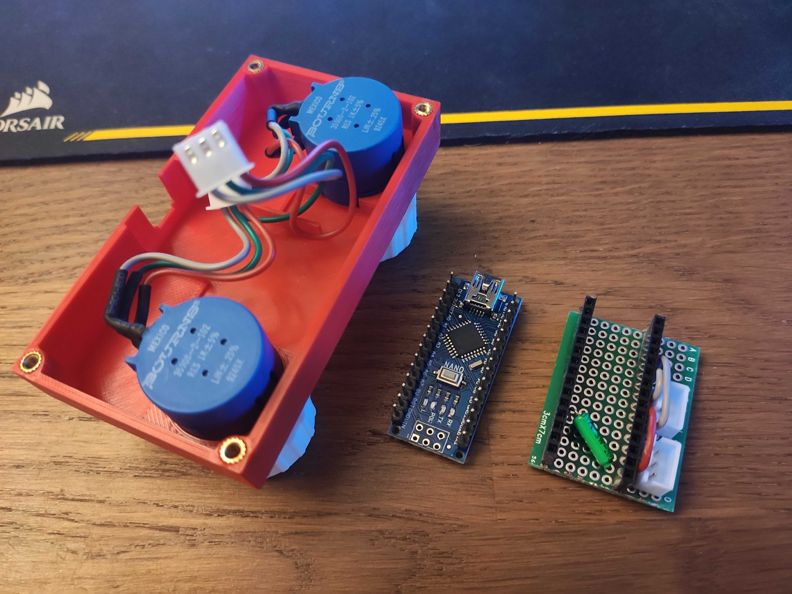

# Etch a Sketch USB

A modern clone of the classic Etch a Sketch game.

More photos below.

### BOM

If you want to make your own, you'll need those things :

- 2x Bourns 3590 potentiometers (see below)
- 1x Arduino Nano
- 1x tilt switch
- wires
- a soldering iron !

Optionnal : 

- female pin headers (to avoid directly soldering the arduino board)
- a piece of protoboard
- 3-pin JST-XH connectors (2x female, 2x male)
- a 3D printer, if you want to print the case & knobs !
- M3x4x4 brass inserts and M3x10 screws (4 of each)

If you buy some JST-XH connectors, to forget to buy the appropriate crimping tool.
I've used Bourns precision potentiometers as I happened to have some of them laying around. You can use any potentiometer (cheap one will work perfectly), but be aware that they probably won't fit perfectly in the 3D printed case.

### How-to

1. Solder and connect everything following diagram below (COMING SOON)
2. 3D print the case and knobs using STL files provided, and assemble everything !
2. Burn provided arduino sketch using Arduino IDE
3. Install Python3 if needed (see [here](https://www.python.org/downloads/))
4. Install PySerial with pip : `pip install pyserial` (or `pip3 install pyserial` or `python3 -m pip install pyserial`, don't know for sure as it depends which Operating System your computer is running)
5. Run `python main.py` (or `python3 main.py`, again it depends on your OS. This app should run on any system where Python3 is available)
6. At launch, you'll be asked to select the serial port on which the device is attached. You can test them all if that's necessary.

## Photos

## Disclaimer

This is a proof of concept, all the programs and instructions provided here are under GNU GPLv3 Licence and aren't supposed to be commercialised. "Etch a Sketch" logo and concept is the property of Spin Master. I'm not responsible if someone ends up selling this thing.